# Vanishing Point Detection and 3D Plane Segmentation

-----------------------
Two different problems are solved here. The first is automatically finding 3 orthogonal vanishing points in Manhattan scenes. Second is detecting and segmenting planar regions of images in 3D.

-----------------------

Automatic vanishing point detection

- Edge Detection using Canny
- Line segmenta formation using Probabilistic Hough Transforms
- Identification of 3 dominant directions of line segments using iterative RANSAC 
- Finding best fitting vanishing points for each direction

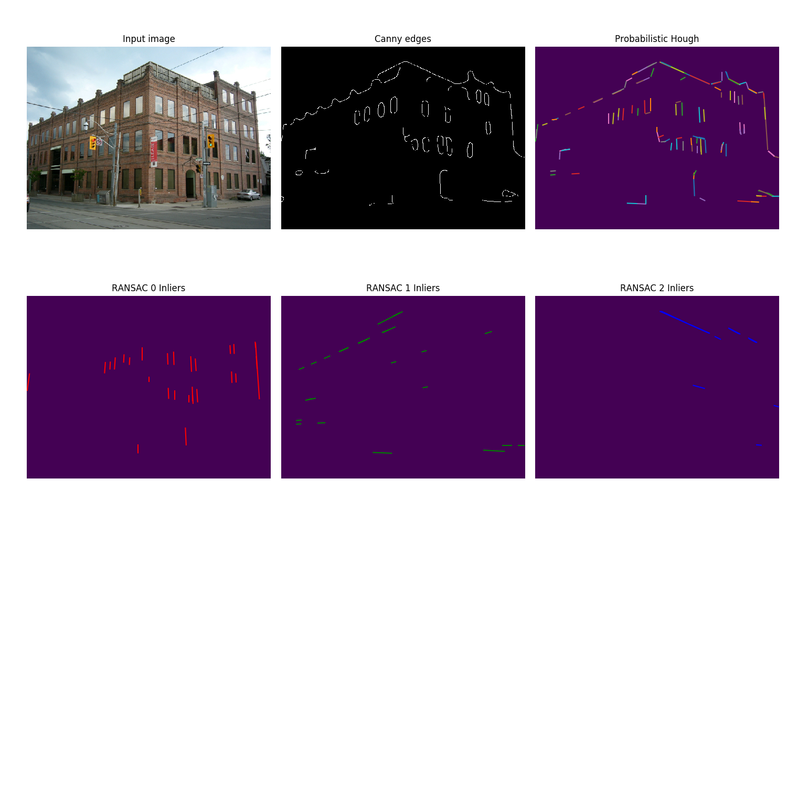

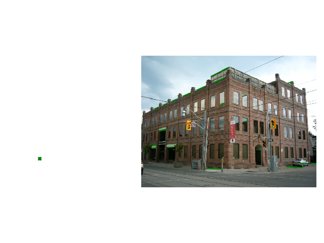

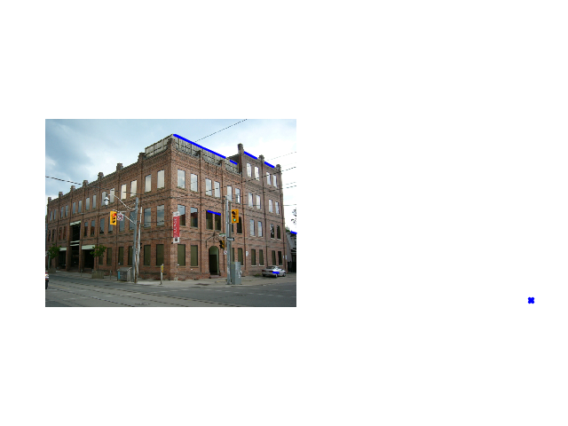

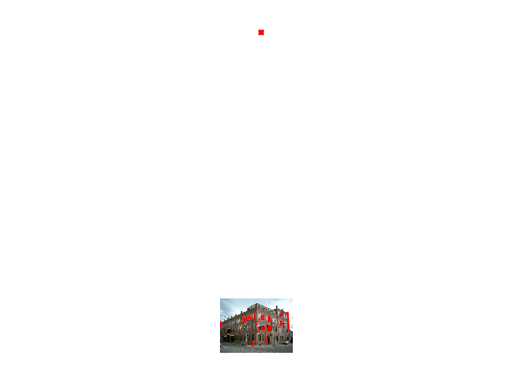

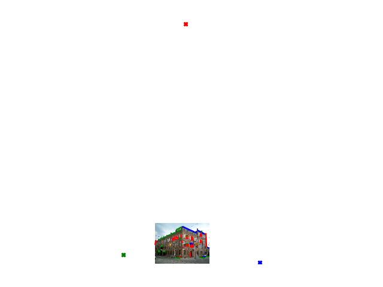

-----------------------

Homography Based Plane Segmentation in 3D

- Getting SIFT features and stereo correspondences
- Autocalibration using vanishing points
- Estimating fundamental matrix and essential matrix from correspondences and camera intrinsics
- Computing the camera matrices for the stereo pair from the essential matrix
- Triangulating the 3D points using the correspondences and the camera matrices
- Running iterative RANSAC to find dominant planes in 3D
- Projecting 3D points to 2D and finding planar homography for each identified plane
- Using a convex hull on the projected points to get all the pixels on each plane in 2D
- Finding dense correspondences using the convex hull points and the planar homography for each plane
- Triangulating dense 3D points using the dense 2d correspondences for each plane

Feature points and stereo correspondences

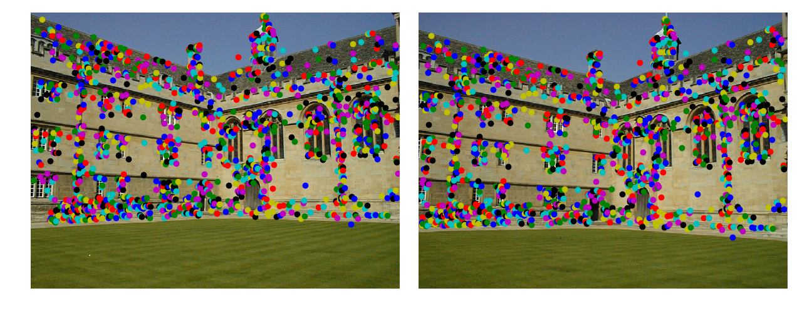

3D point triangulation after autocalibrating and computing camera matrices

 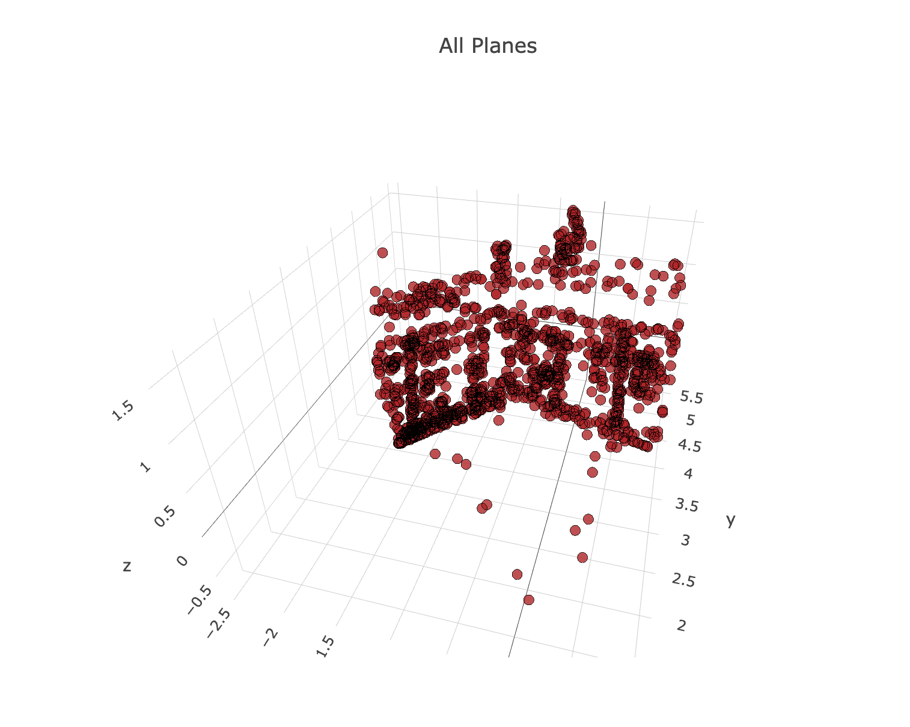 

Estimating dominant planes in 3D with iterative RANSAC

  

Projecting 3D plane points and finding planar homography

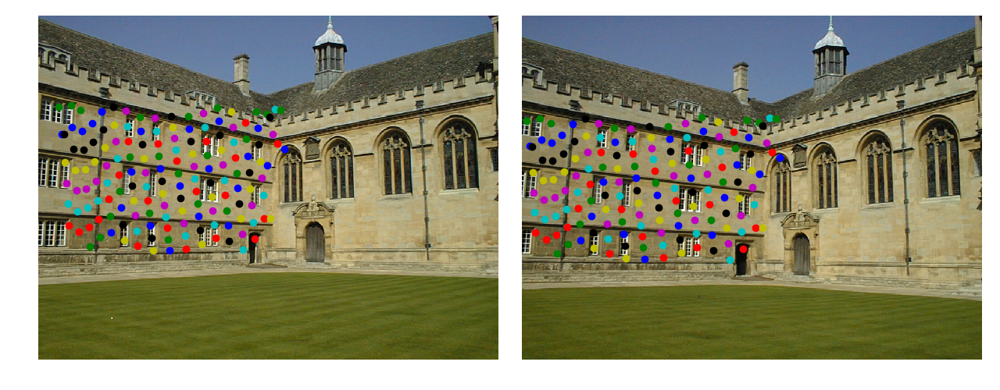

Fitting a convex hull and getting dense 2D points on each plane

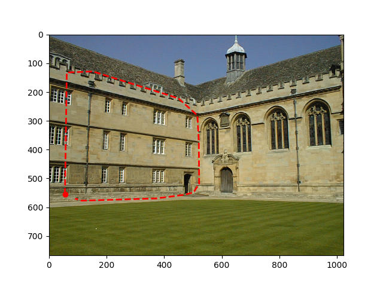 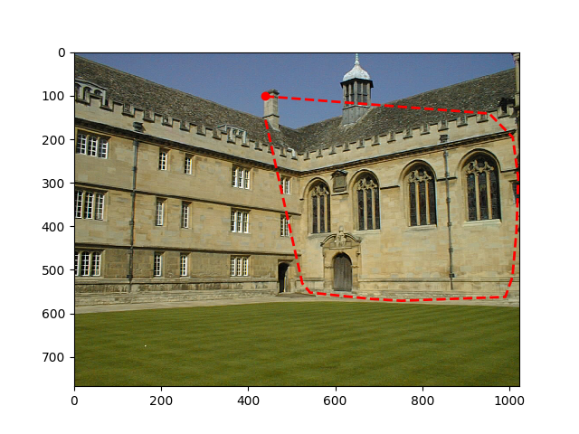

Triangulating dense 3D points for each plane

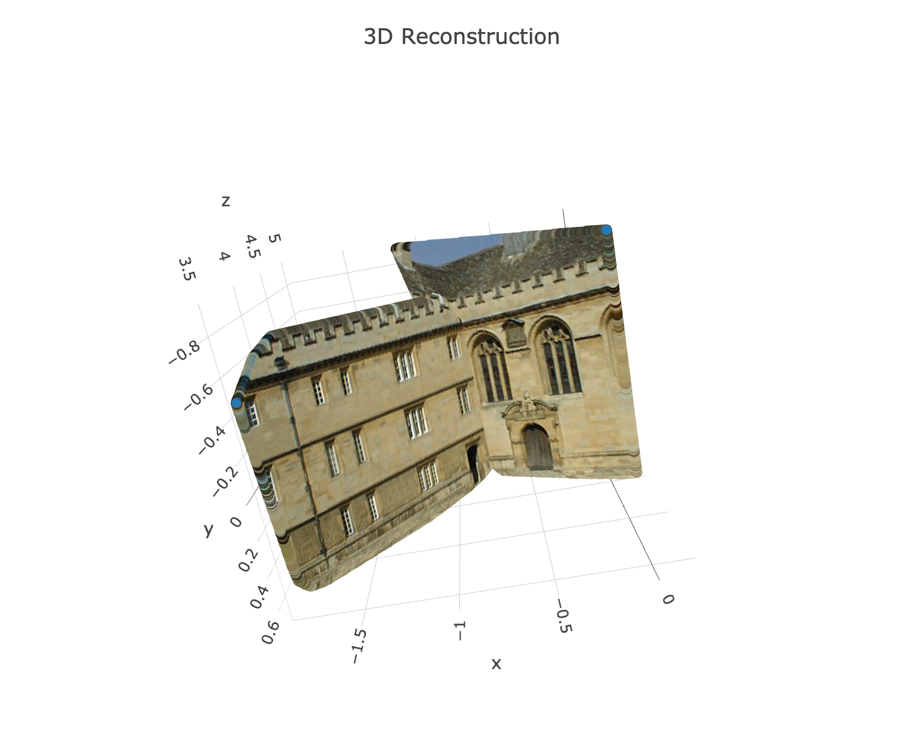 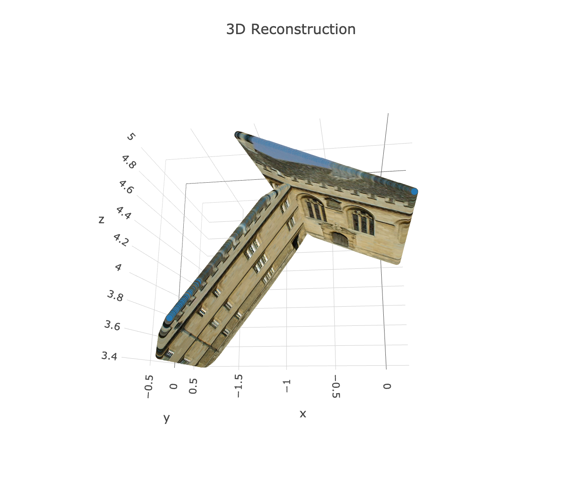

-----------------------